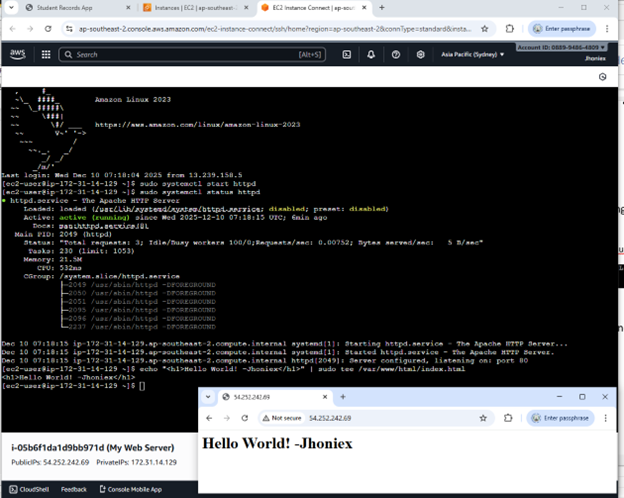
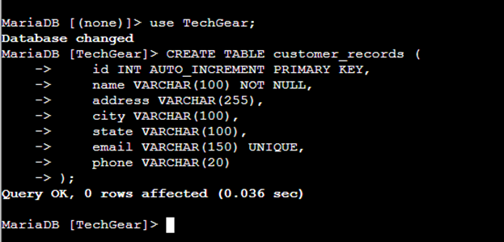
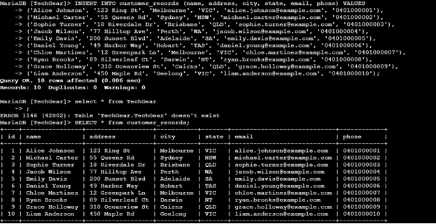
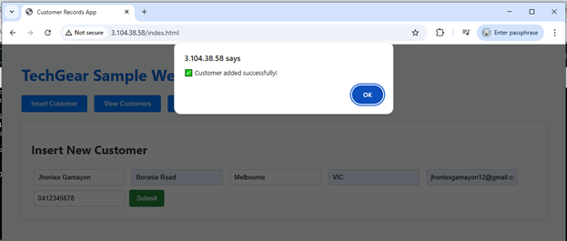
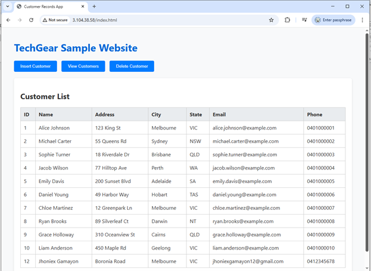
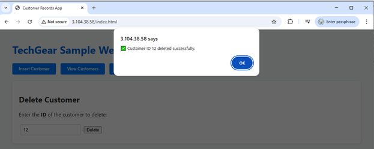

# Sample Application on AWS

## Creating the Compute Layer (EC2 Instance)

The application began by launching an EC2 instance using Amazon Linux, t2.micro, and a newly created security group allowing ports 22 (SSH), 80 (HTTP), and 3000 (API). Apache HTTP Server was installed and enabled, allowing the instance to host a basic webpage.



## Creating the Database Layer (RDS Instance)

A MariaDB database was created using Amazon RDS. This represents TechGear’s current MySQL customer database moving into the cloud. RDS handles backups, updates, monitoring, and storage automatically, which reduces the manual work TechGear’s staff currently face.
The database was placed in a private subnet to improve security and protect customer information. EC2 communicated with the RDS instance through a secure connection.

I also created a MariaDB database using both Amazon Aurora and the RDS service and connected it to my previously made EC2 instance.

In my EC2 terminal I run the following command to install MariaDB:

```bash
sudo dnf install -y mariadb105
mysql -h database-1.cjy6eys0ip8k.ap-southeast-2.rds.amazonaws.com -P 3306 -u admin -p
```

To match the business scenario, we created a new database called TechGear inside the EC2 instance. This database was used to simulate how TechGear Solutions would store customer information in the cloud. The database was created using the command CREATE DATABASE TechGear; and then selected with USE TechGear;. Inside the database, we created a table named customer_records which holds basic customer details such as name, address, city, state, email, and phone number.
The table was created using the following SQL command:

```bash
CREATE TABLE customer_records ( id INT AUTO_INCREMENT PRIMARY KEY, name VARCHAR(100) NOT NULL, address VARCHAR(255), city VARCHAR(100), state VARCHAR(100), email VARCHAR(150) UNIQUE, phone VARCHAR(20) );
```

This simple structure allowed us to test how a real customer database would run on AWS and how it could support TechGear’s planned order tracking system.



After creating the customer_records table, we added sample customer data to simulate how TechGear would store real customer information in the cloud. This helped us test the database connection, API functions, and front end operations. We inserted ten sample customers using an INSERT INTO SQL command, each with details such as name, address, city, state, email, and phone number. Once the data was inserted, we confirmed that it was successfully stored by running a SELECT \* FROM customer_records; query, which displayed all customer records in the table. This showed that the database was working correctly and that the application could read the customer information without errors.



## Building the Backend API (Node.js Server)

The Node.js backend was developed on the EC2 instance. Node.js was installed using the following command:

```bash
curl -fsSL https://rpm.nodesource.com/setup_20.x | sudo bash –
sudo dnf install -y nodejs
```

1. Created project folder and installed required modules (express, cors, mysql2, body-parser).

```bash
mkdir customer-api && cd customer-api
npm init -y
npm install express cors mysql2 body-parser
```

2. The backend API (apiServer.js) was implemented using Express, with routes for:

- Adding new student records
- Retrieving all records
- Deleting a student by ID

3. Using the command nano apiServer.js to open the js file and edit it. I used the provided sample code during the tutorial.
4. Developed a REST API (apiServer.js) with routes to:

- Used the command “nohup node apiServer.js > output.log 2>&1 &” to start the server.
- Insert a customer record sample data using the API “.
- Delete a customer record based on its ID using the api “curl -X DELETE http://localhost:3000/customers/1”

Sample API operations, including inserting and deleting records using curl, confirmed correct functionality.

## Building the Front-End Website

T he front-end was developed inside /var/www/html/index.html using HTML, CSS, jQuery, and AJAX calls that interacted with the Node.js backend.

The website allowed users to:

- Insert customer records



- View all stored records



- Delete a customer by ID



Testing confirmed that the EC2 instance communicated correctly with RDS through port 3306, and that the API responded as expected. All interactions were routed through the Node.js API hosted on port 3000. Successful AJAX responses verified proper communication between EC2 (frontend), EC2 (backend), and RDS (database).
