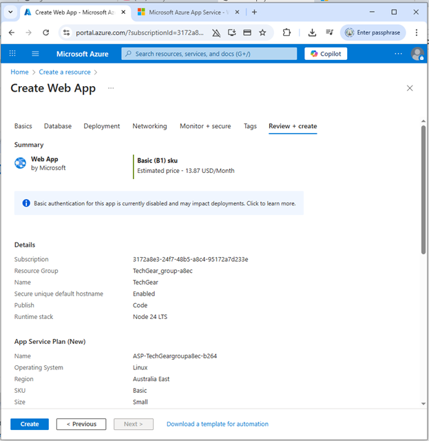
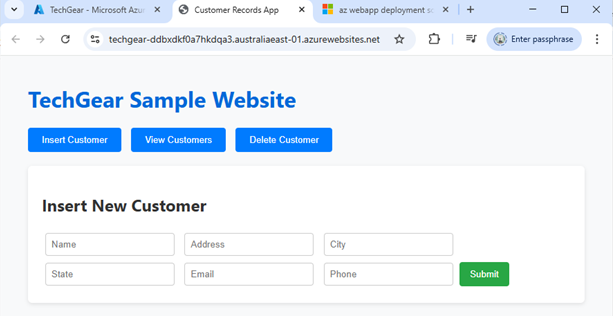
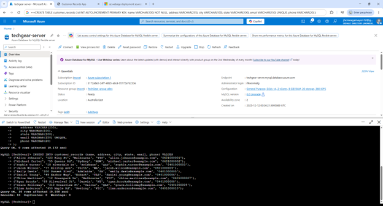
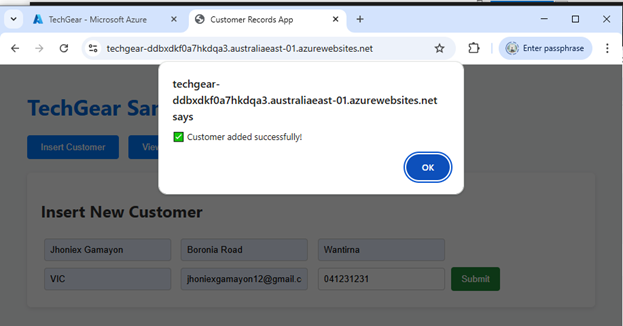
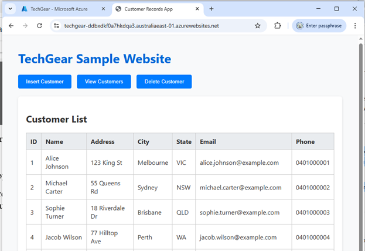
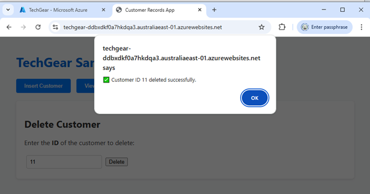

# Creating the Compute Layer (Azure App Service)

The application was deployed using Azure App Service, a fully managed PaaS environment that automatically handles load balancing, updates, runtime management, and auto-scaling.
Steps performed:

1. Navigated to the Azure Portal and created a new Web App.
2. Selected:
   - Runtime stack: Node.js 24 LTS
   - Hosting Plan: Basic B1 (suitable for testing and small production workloads)
   - Region: Australia East (to ensure low latency for TechGear’s customers)
3. Azure automatically created the hosting environment, file structure, and continuous deployment pipeline.



Deployment Process:

- Used the “Deployment Center” within Azure App Service.
- Connected the Web App to a GitHub repository containing the same Node.js API used on AWS.
- Azure built, deployed, and started the application automatically.

Outcome:

The Node.js backend API was live without needing to configure virtual machines, security groups, or operating systems. This highlights why Azure App Service can significantly reduce operational effort for TechGear’s future applications.



## Creating the Database Layer

To replicate the functionality of the customer_records table from AWS, a relational database was created using MySQL Database, a fully managed cloud database service.
Database Setup:

1. Created an MySQL Server instance and enabled transparent data encryption.
2. Created a new SQL Database named TechGear.
3. Configured firewall rules to allow access only from the App Service environment.
4. Connected using Azure Cloud Shell
   Table Creation:
   A similar customer table was created to maintain parity with the AWS prototype:

```bash
CREATE TABLE customer_records (
    id INT IDENTITY(1,1) PRIMARY KEY,
    name VARCHAR(100) NOT NULL,
    address VARCHAR(255),
    city VARCHAR(100),
    state VARCHAR(100),
    email VARCHAR(150) UNIQUE,
    phone VARCHAR(20)
);
```

Sample data insertion:
Ten test customer records were inserted using INSERT INTO statements to populate sample data as same with what we did in the AWS sample.



## Building the Backend API (Node.js on Azure App Service)

The same Node.js Express API used in the AWS prototype was reused to ensure a fair comparison. The API included routes for:

- Inserting new customer records



- Retrieving all customer records



- Deleting a customer record by ID



The website has been deployed using Azure Deployment Center, which can be accessed through https://techgear-ddbxdkf0a7hkdqa3.australiaeast-01.azurewebsites.net/ . It is connected to a GitHub repository containing the application source code. Once linked, Azure automatically:

- Pulled the source code
- Installed dependencies
- Built the application
- Started the Node.js service

We didn’t perform any manual SSH access, package installation, or process management (such as nohup) because it is not required. This highlights Azure’s advantage in reducing deployment complexity. The backend API became publicly accessible through the App Service URL, with HTTPS enabled by default.
