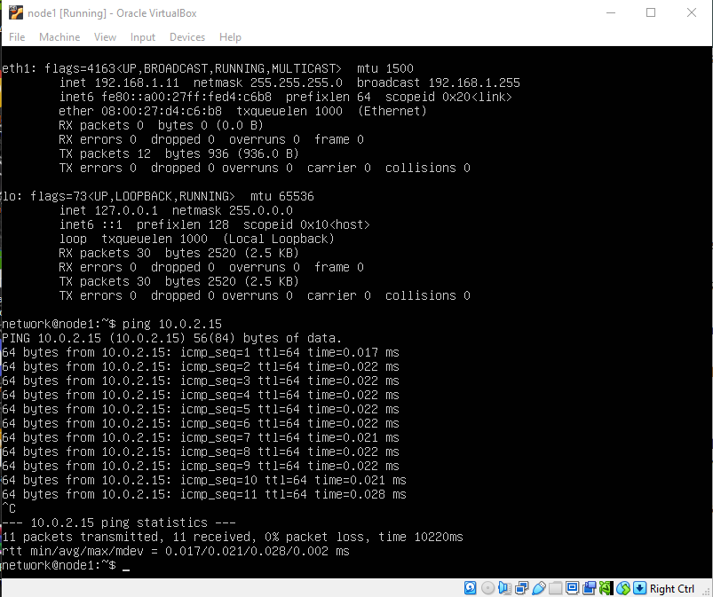
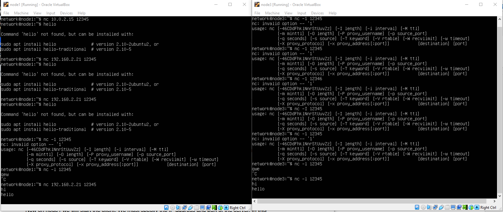
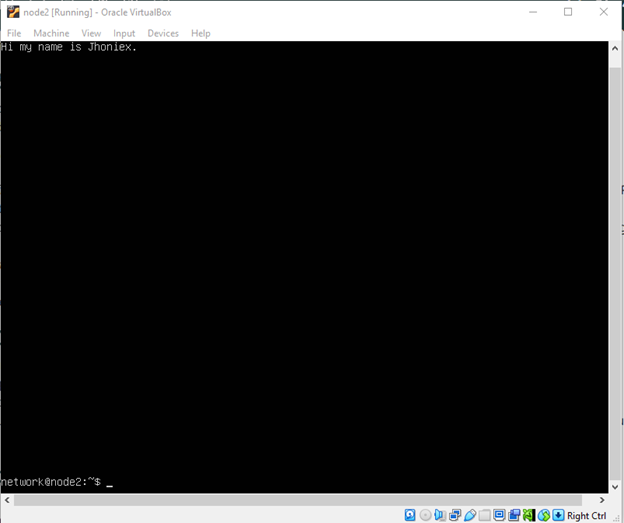
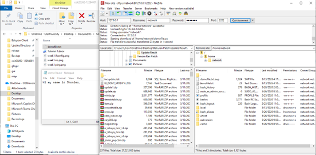
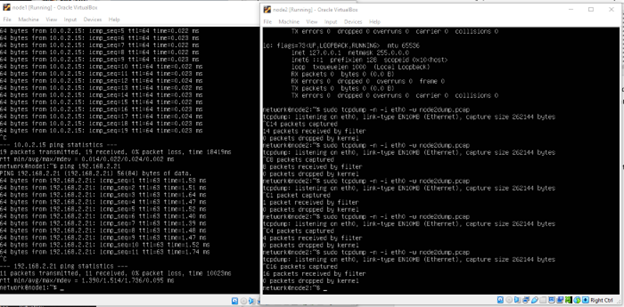

# Testing of Virtual Network and Capturing Ping between servers.

## Use ifconfig to view the IP address of node3.

I used the command “ifconfig” to display and know the IP address of all nodes.

## Use ping to test connectivity from node1 to node3.

In this part, I used “ping” command to ping node 3 ip which is 10.0.2.15

## Use netcat to test delivery of a message using TCP from node1 to node3.

I used “nc -l 12345” command in node 3 to open the 12345 port for messaging. In the node 3 I used “nc 192.168.2.21 12345” command to connect my node 1 to node 3 via 12345 port which is message. As a result, I can send/receive messages in both nodes.

## Use nano to create an example text file on node2.

In my node2, using the command “nano demofile.txt” I made a txt file named demofile.txt and input my name inside for sample.

## Copy the example text file from Linux node2 to your computer using FileZilla or WinSCP.

Using filezilla, I connected to 127.0.0.1:2202 (node 2 port) and I found the demofile.txt that I created inside. Copied it to my Desktop folder and open it and the content is exactly what I did.

Task 4

1. Using virtnet topology 5, ping from node1 to node3 and capture the traffic on node2
   

2. Text
   
