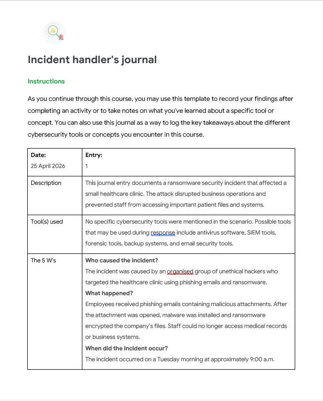

# Incident Handler’s Journal

A professional cybersecurity documentation project demonstrating incident response knowledge, security analysis, and hands-on familiarity with tools such as Wireshark, Splunk, and threat investigation processes.

Open full pdf journal: [Incident Handler Journal](./Incident-handlers-journal.pdf)

