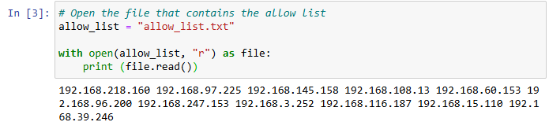
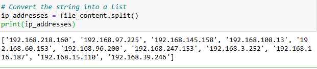
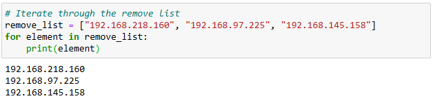
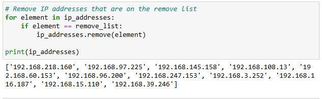
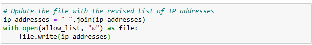
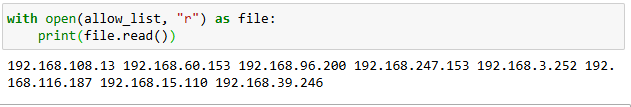

# Algorithm for file updates in Python

## Project description

In this project we are assuming the position as a security professional working at a health company, the task is to regularly update the file list of employees who can access restricted content. The contents of the file are based on who is working with personal patient records. Employees are restricted access based on their IP address. There is an allow list for IP addresses permitted to sign into the restricted subnetwork. There's also a remove list that identifies which employees you must remove from this allow list.

Using Python programming language, we will create an algorithm to check whether allow list contains any IP addresses identified on the remove list. If so, we should remove those IP addresses from the file containing the allow list.
Open the file that contains the allow list
Using Jupyter notebook, we opened the allow_list.txt file with python code open with first parameter as the txt file name and second parameter as the read type. We stored it in the variable file.

## Read the file contents

We read the file contents by printing it in file.read() to display all contents.

## Convert the string into a list

To normalize data, we will convert the contents which is currently in strings into a list format. We declared a variable called ip_addresses to store the list of ip that we converted, we will use the .split() method to convert file_content strings into a list.

## Iterate through the remove list

We declared a new variable called remove_list to store the list of IP address that we will remove on the ip_addresses list. We printed each ip address by iterating using for loop with each element in the list.

## Remove IP addresses that are on the remove list

This code uses nested loops to compare every IP address in remove_list with each IP in ip_addresses. If a match is found, that IP address is removed from ip_addresses. After all comparisons are completed, the updated list is printed.

## Update the file with the revised list of IP addresses

This code updates the allow list file with the revised IP addresses. The list items are combined into one string separated by spaces using " ".join(ip_addresses), then the file is opened in write mode ("w") and the updated data is saved to the file.

Finally, this code will re-open the allow_list.txt to check if the ip listed in remove_list has been successfully removed.

## Summary

In this project, we used Python to automate the process of updating an allow list for restricted network access in a healthcare company. The algorithm opened the file, read the stored IP addresses, converted the data into a list, compared it with the remove list, and removed any unauthorized IP addresses. As a result, the updated allow list was written back to the file. This process helps improve security, reduce manual work, and ensure only authorized employees can access sensitive patient records.
