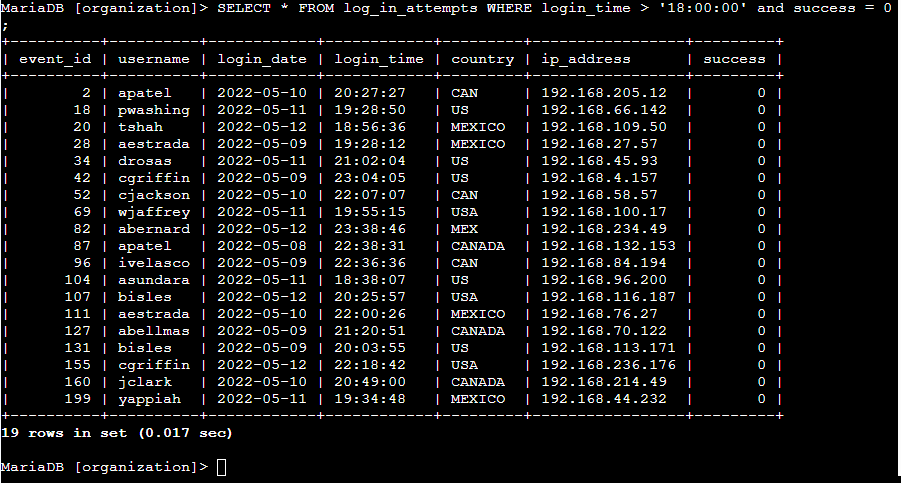
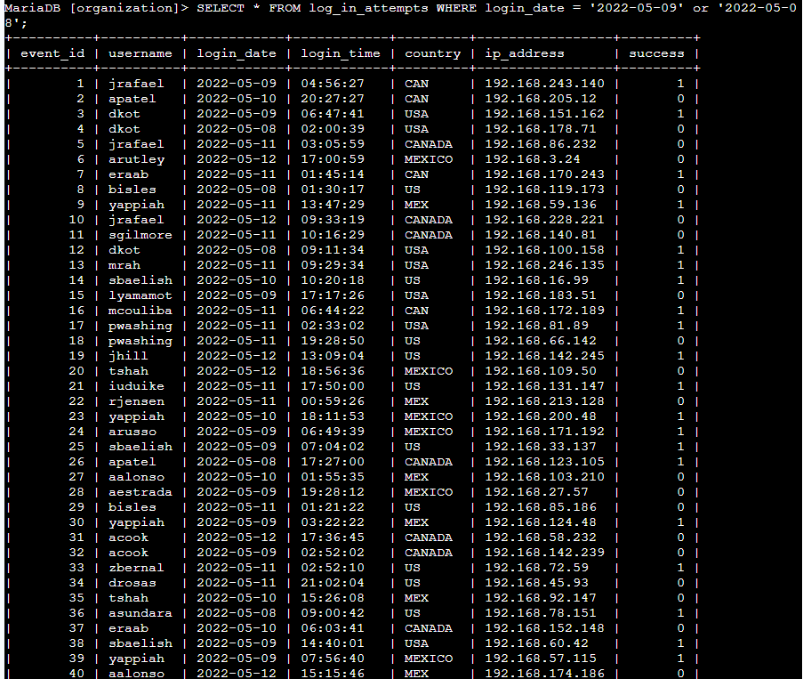
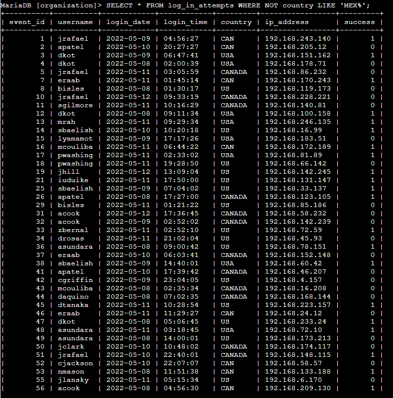

# <p align="center">Apply filters to SQL queries</p>

## Project description

In this activity, we are going to create a portfolio in order to demonstrate my experience in using SQL during my Google Cybersecurity certificate.

The scenario:

You are a security professional at a large organization. Part of your job is to investigate security issues to help keep the system secure. You recently discovered some potential security issues that involve login attempts and employee machines.

Your task is to examine the organization’s data in their employees and log_in_attempts tables. You’ll need to use SQL filters to retrieve records from different datasets and investigate the potential security issues.

The table format for our sample database can be found here : [Table Format](./Table%20formats.pdf)

## Retrieve after hours failed login attempts

The Problem :

Having recently discovered a potential security incident that occurred after business hours. To investigate this, we need to query the log_in_attempts table and review after hours login activity. Use filters in SQL to create a query that identifies all failed login attempts that occurred after 18:00. (The time of the login attempt is found in the login_time column. The success column contains a value of 0 when a login attempt failed; you can use either a value of 0 or FALSE in your query to identify failed login attempts.)

Using the SQL query:

```bash
SELECT * FROM log_in_attempts WHERE login_time > '18:00:00' and success = 0;
```



## Retrieve login attempts on specific dates

The Problem :

A suspicious event have been found, it occurred on 2022-05-09. To investigate this event, we will review all login attempts which occurred on this day and the day before. Use filters in SQL to create a query that identifies all login attempts that occurred on 2022-05-09 or 2022-05-08. (The date of the login attempt is found in the login_date column.)

Using the SQL query:

```bash
SELECT * FROM log_in_attempts WHERE login_date = '2022-05-09' or '2022-05-08';
```



## Retrieve login attempts outside of Mexico

The Problem :

There’s been suspicious activity with login attempts, but the team has determined that this activity didn't originate in Mexico. Now, you need to investigate login attempts that occurred outside of Mexico. Use filters in SQL to create a query that identifies all login attempts that occurred outside of Mexico. (When referring to Mexico, the country column contains values of both MEX and MEXICO, and you need to use the LIKE keyword with % to make sure your query reflects this.)

Using the SQL query:

```bash
SELECT * FROM log_in_attempts WHERE NOT country LIKE 'MEX%';
```



## Retrieve employees in Marketing

[Add content here.]

## Retrieve employees in Finance or Sales

[Add content here.]

## Retrieve all employees not in IT

[Add content here.]

## Summary

[Add content here.]
